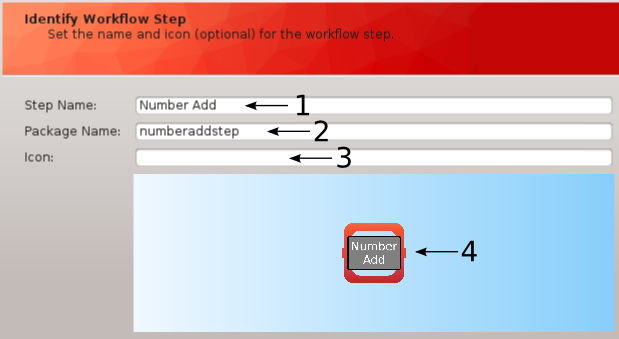
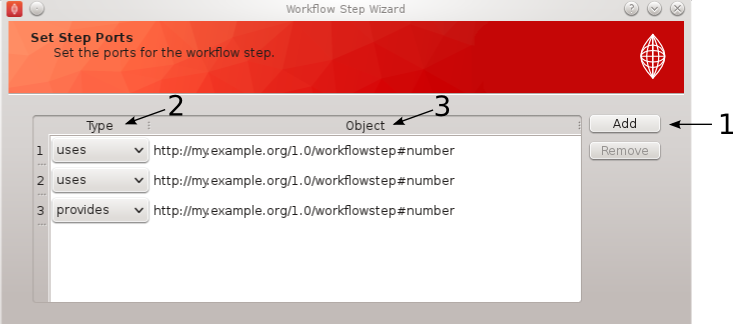
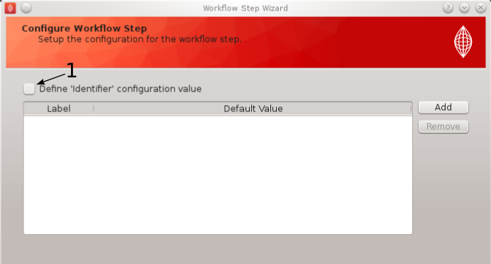
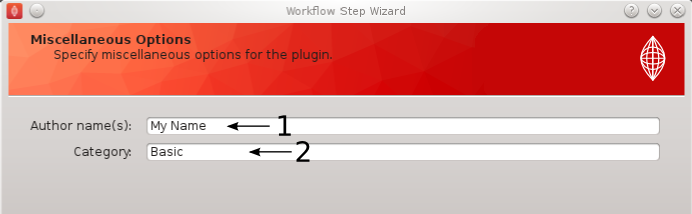
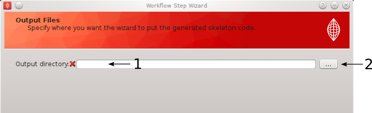
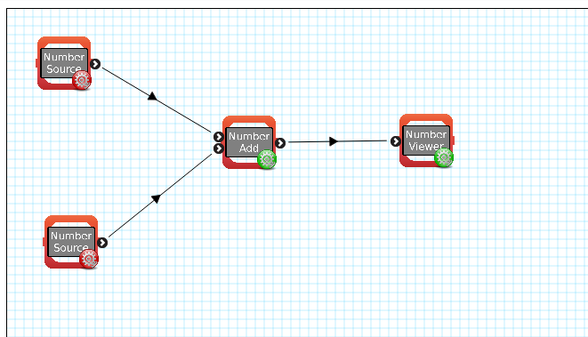

.. _mapclient-pluginauthoring:

======================
Creating your own step
======================

The purpose of this task is to demonstrate how to take your own existing code and define a MAP Client step.   In this task the code we want to incorporate into a MAP Client step is a very simple python script that adds together two numbers.  To do this we will make use of the MAP Client plugin wizard, documentation for the plugin wizard is available here :ref:`MAP-plugin-wizard`, which will create the skeleton code for our step.  Then we will edit the generated code so that it makes use of our simple python script.

Our Code
========

The code we want to make use of is simply::
  
   def addNumbers(num1, num2):
       return num1 + num2

A function that returns sum of two given numbers.  We will save this function into a file 'mycode.py' into the step directory once it has been created.

Generate Skeleton Step
======================

To generate the step we will make use of the MAP Client plugin wizard tool, this tool will create a skeleton step with which we will connect our code to.  With the MAP Client application started select the 'Plugin Wizard' option from the 'Tools' menu.  When the wizard introductory page appears click next to move onto the 'Identify Step' page.  

Identify Step
-------------

On the 'Identify Step' page we will add the text 'Number Add' to the Step Name edit box [**1**], the package name will automatically be filled in the Package Name edit box [**2**].  We are free to edit the Package Name to something different if we wish but we won't do that on this occasion.  Leave the Icon edit box [**3**] empty.  We can see a preview of how our new step will look in the preview panel [**4**].

   
   **Figure 1**: Wizard identify page for 'Number Add' step.

When you have named your step click the next button to move onto the Step Ports page.

Ports
-----

On the 'Ports' page we will define the ports for our step.  In this very simple case our ports will be synonmous with the inputs and outputs to our function addNumbers.  This then means we want to define two input ports and one output port.  To do this we use the Add button [**1**] to add three ports to our step.  When the Add button is clicked a default port is added.  The default port has the port type set to provides and the port object as empty.  We need two input ports for our step so we need to change two of the ports type to show uses.  This is done simply by using the combobox in the type column [**2**] and selecting the uses option.  

.. note::
   
   The order of the ports is unimportant we will match against port type and port index to determine where each input and output belongs.
   
 
All the ports in out step are using the same type of object.  This object is defined by the string::
  
   http://my.example.org/1.0/workflowstep#number
   
adding this text into the object column [**3**] for all three ports defines each port to be able to handle this type of object.  The port object needs to match existing steps 'Number Source' and 'Number Viewer' which provide and use this object respectively.  Double-click on a port object entry to edit the value.  When your page looks like **Figure 2** click the next button to move onto the 'Configure Step' page

   
   **Figure 2**: Wizard port page for 'Number Add' step.

Configure
---------

On the 'Configure' page we can set up the configurable parameters for our step.  In this simple case we don't have any configuration for this step.  All we need to do is to uncheck the identifier configuration checkbox [**1**] our 'Configure' page should look like **Figure 3** and click the next button to move onto the 'Miscellaneous' page.

   
   **Figure 3**: Wizard configure page for 'Number Add' step.

Miscellaneous
-------------

On the 'Miscellaneous' page we can set the step author and the category for the step.  The step category will let the MAP Client know under which heading we want the step to be shown in the step box.  In the author edit box [**1**] add your name and in the category edit box [**2**] add the text 'Basic'.  When you have something similar to **Figure 4** click the next button to move onto the 'Output' page.

   
   **Figure 4**: Wizard miscellaneous page for 'Number Add' step.

Output
------

On the 'Output' page we set the directory into which we want the skeleton step to be written.  Either directly set the output directory by editing the output directory edit box [**1**] or use the directory chooser dialog to set it for you (accessible through clicking [**2**]).

   
   **Figure 5**: Wizard output page for 'Number Add' step.

Once a suitable existing directory is chosen click the finish button to generate the skeleton step we have defined.

If everything has gone well an information dialog will appear to say that the skeleton step has been successfully written to disk.

Connect Our Code
================

At this point we actually have a step that will be visible to us and usable from within the MAP Client application.  This step however doesn't yet do anything, it doesn't connect up to our code and make use of it and it cannot be configured and thus used in a workflow that we can execute.  What we need to do now is create a Python module that contains our code, edit the skeleton step so that it makes use of our code and modify the step so that it can be configured and interact with other steps.

Create Our Code
---------------

Here we will create a Python module that will contain our code.  Using a text editor create a new file called 'ourcode.py' and save it in the directory::

   <output directory>/mapclientplugins.numberaddstep/mapclientplugins/numberaddstep

where <output directory> is the output directory that was set above in `Output`_.

Add the function from `Our Code`_ to this file and save it.

Make Use of Our Code
--------------------

To make use of our code we need to edit the step.py file which can be found in::

   <output directory>/mapclientplugins.numberaddstep/mapclientplugins/numberaddstep

at the top of this file just below the line::

   from mapclient.mountpoints.workflowstep import WorkflowStepMountPoint

we want to import our method from ourcode.py Python module.  This can be done in a variety of ways and we shall use the following method::

   from mapclientplugins.numberaddstep.ourcode import addNumbers
   
now inside the execute method of the class NumberAddStep add the following line of code::

   self._output = addNumbers(self._input_1, self._input_2)
   
place this code before the call to the class method _doneExecution.
   
Modify Step
-----------

Next we need to modify the code in step.py so that the step is configurable and so that it can receive and pass the values required at the appropriate time.  We will start with editing the __init__ method.  Set the _configured class attribute to True and add three new class attributes _output, _input_1 and _input_2 initialise all their values to None.  With this done our __init__ method will contain the following::

   self._configured = True # A step cannot be executed until it has been configured.
   self._output = None
   self._input_1 = None
   self._input_2 = None
   
.. note::
   
   Make sure your indentation is done with spaces and not tabs.
   
When this is done we need only to change the setPortData and getPortData methods to look like the following::

    def setPortData(self, index, dataIn):
        '''
        Add your code here that will set the appropriate objects for this step.
        The index is the index of the port in the port list.  If there is only one
        uses port for this step then the index can be ignored.
        '''
        if index == 0:
            self._input_1 = dataIn # http://my.example.org/1.0/workflowstep#number
        else:
            self._input_2 = dataIn # http://my.example.org/1.0/workflowstep#number

    def getPortData(self, index):
        '''
        Add your code here that will return the appropriate objects for this step.
        The index is the index of the port in the port list.  If there is only one
        provides port for this step then the index can be ignored.
        '''
        return self._output

That is all we need to do.  We have now connected up our own code to our step.

Create Workflow
===============

To finish this task we will create a workflow that makes use of our newly created step.  For this we will first need to make sure that our step is available in our step box.  We can do this using the 'Plugin Manager' tool available from the 'Tools' menu.  With the plugin manager dialog open add the <output directory> to the list of plugin directories and click the Ok button (if the <output directory> is already in the list of plugins directories click the reload button before clicking the Ok button).

Using the Number Source step and the Number Viewer step create a workflow that looks like **Figure 6**.

   
   **Figure 6**: Workflow making use of the 'Number Add' step.

Now we need to configure the two number source steps, click on the red gear icon for each in turn and set the identifier for each as input_1 and input_2.  Once this is done all the configure icons should be green.

Save the workflow to a directory on the local disk and then hit the execute button.  This will display the sum of the numbers for the two number source steps.
